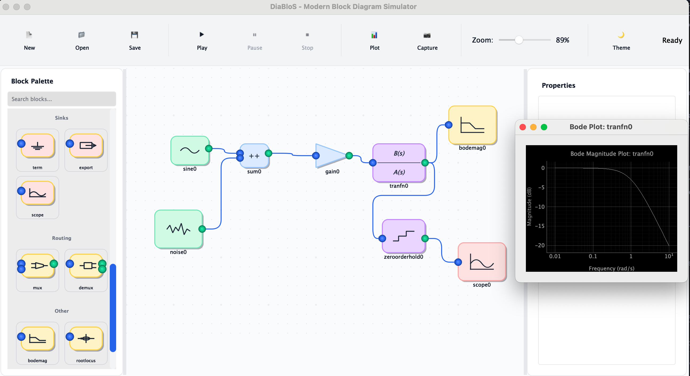

# DiaBloS - Modern

A modern, Python-based graphical tool for simulating dynamical systems. This project is an evolution of the original DiaBloS, featuring a completely revamped user interface built with PyQt5 and a focus on a more intuitive, and productive user experience.



## Key Features

- **Modern, Themable UI**: Switch between light and dark modes instantly.
- **Interactive Canvas**: A zoomable, pannable canvas for building your simulations.
- **Drag-and-Drop**: Easily add new blocks by dragging them from the palette.
- **Streamlined Property Editing**: Select a block and edit its parameters directly in a panel that automatically applies changes.
- **Dynamic Layout**: UI panels can be resized, and the property editor adjusts its height to fit the content.
- **Stable Simulation Engine**: Leverages the original, battle-tested simulation core with significant enhancements for stability and error handling.

## Getting Started

### Requirements

- Python 3.9+
- A GUI environment with X11 support (will not work headless)

### Installation

1.  Clone the repository:
    ```bash
    git clone https://github.com/Sapetor/diablos-modern.git
    cd diablos-modern
    ```

2.  Install the required dependencies:
    ```bash
    pip install pygame numpy matplotlib tk tqdm pyqtgraph pyqt5 scipy
    ```

### Running the Application

To run the modern version of DiaBloS, execute the following command:

```bash
python diablos_modern.py
```

## Basic Usage

1.  **Add Blocks**: Drag blocks from the **Block Palette** on the left onto the main canvas.
2.  **Connect Blocks**: Click on an output port (right side of a block) and then on an input port (left side of a block) to create a connection.
3.  **Edit Properties**: Click on a block to select it. Its properties will appear in the **Properties** panel at the bottom. Edit the values directly; changes are saved automatically.
4.  **Run Simulation**: Click the **Play** button in the toolbar to run the simulation.
5.  **View Plots**: If you have a `Scope` block in your diagram, the plot will appear once the simulation is finished.

## License

This project is licensed under the MIT License. See the [LICENSE](LICENSE) file for details.
