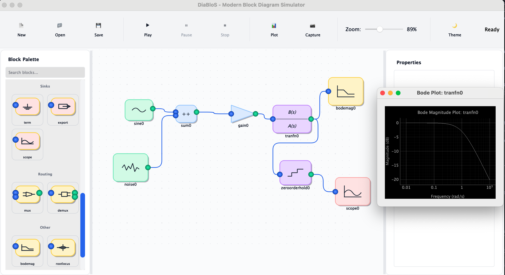

# DiaBloS Modern

DiaBloS Modern is a PyQt5-based block-diagram simulator with a refreshed UI, MVC core, and a growing control-toolbox. It targets quick assembly of dynamic systems, fast iteration, and clear visualization.



## Highlights
- Modern canvas: drag/drop palette, zoom/pan, snap-to-grid, property editor with live apply.
- Control & routing blocks: PID, saturation, rate limiter, hysteresis, deadband, switch (multi-input with control port), PRBS source, mux/demux, Goto/From tag routing. Tags auto-link, are validated, and a small HUD shows tag counts.
- Waveform Inspector: per-run history from scopes, run pinning, CSV export, optional on-disk persistence, step plotting for discrete signals.
- Simulation integrity: algebraic-loop detection, diagram validation (disconnected ports, duplicate inputs, tag issues), autosave before run.
- **Fast Solver**: Hybrid engine with compiled execution using `scipy.integrate`. Automatically accelerates supported systems (Integrator, Gain, Sum, Sine, etc.) by flattening the diagram into efficient numerical code. See [docs/FAST_SOLVER.md](docs/FAST_SOLVER.md) for details.
- **Analysis & control toolbox**: numeric linearization (Jacobian of the compiled ODE) with Bode, Nyquist, root-locus, LQR, and pole-zero / step-impulse views, plus trim / operating-point solving.
- **Experiments**: seeded Monte Carlo ensembles and 1-D/2-D parameter sweeps that re-run a diagram headlessly and aggregate results without mutating it.
- **PDE & optimization blocks**: 1D/2D heat, diffusion-reaction, and advection equations visualized with FieldScope (GIF/MP4 export); gradient-descent / momentum / Adam primitives.
- **Export**: render diagrams to TikZ/LaTeX for papers and slides, to PNG/SVG images, or to a **standalone Python script** (numpy + scipy only) that reproduces the compiled solver's results outside DiaBloS.
- **Headless CLI**: `python diablos_modern.py run diagram.diablos -o out.csv` simulates without the GUI and exports Scope traces to CSV/NPZ; `export-python` writes the standalone script. Handy for scripting and CI.
- **Tested**: 2,700+ test pytest suite (unit / integration / regression / GUI) on a Python **3.9 + 3.12** CI matrix, with a `ruff` lint gate.

## Requirements
- Python 3.9+
- GUI-capable environment (PyQt5). For headless CI, set `QT_QPA_PLATFORM=offscreen`.

## Install

Prebuilt apps are on the [Releases page](https://github.com/Sapetor/diablos-modern/releases) —
built from tags by `.github/workflows/release.yml`, with a macOS arm64 `.dmg` and a
Windows x64 `.zip` per release. Both are unsigned; the release notes list the
one-time steps to open them.

From source:
```bash
git clone https://github.com/Sapetor/diablos-modern.git
cd diablos-modern
pip install -r requirements.txt
```

## Run
```bash
python diablos_modern.py
```

## Basic Flow
1) Drag blocks from the palette to the canvas.  
2) Click an output port, then an input port to connect.  
3) Select a block to edit parameters in the property panel.  
4) Add `Scope` blocks to visualize signals; press **Show Plots** to open the Waveform Inspector.  
5) Use `Goto`/`From` blocks to route by tag instead of long wires; set `signal_name` or `tag` to label the virtual link.

## Waveform Inspector
- Opens from **Show Plots**. Displays the last runs (limit configurable, pinned runs kept).
- Toggle traces and runs, scrub with the time slider, export selected traces to CSV.
- Optional persistence: enable in the inspector to save run history to `saves/run_history.json` across sessions.

## Development
```bash
pip install -r requirements-dev.txt
QT_QPA_PLATFORM=offscreen pytest          # run tests headlessly
ruff check .                              # lint (config in pyproject.toml)
ruff format .                             # format
```
More detail: `docs/ARCHITECTURE.md`, `docs/DEVELOPER_GUIDE.md`, `tests/README.md`.

## License
MIT. See `LICENSE`.
