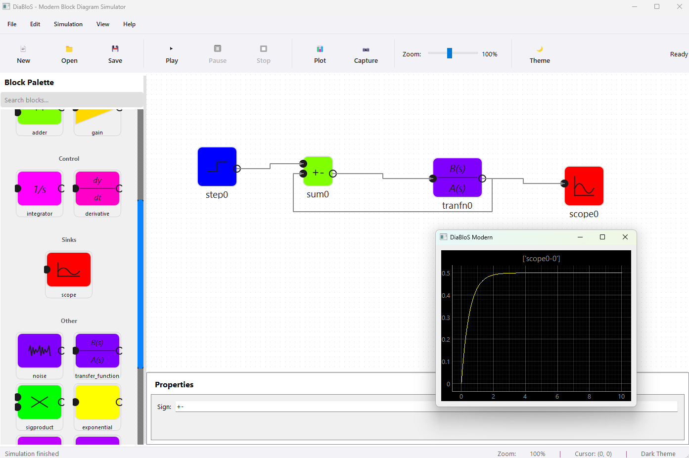

# DiaBloS Modern

DiaBloS Modern is a PyQt5-based block-diagram simulator with a refreshed UI, MVC core, and a growing control-toolbox. It targets quick assembly of dynamic systems, fast iteration, and clear visualization.



## Highlights
- Modern canvas: drag/drop palette, zoom/pan, snap-to-grid, property editor with live apply.
- Control & routing blocks: PID, saturation, rate limiter, hysteresis, deadband, switch (multi-input with control port), PRBS source, mux/demux, Goto/From tag routing. Tags auto-link, are validated, and a small HUD shows tag counts.
- Waveform Inspector: per-run history from scopes, run pinning, CSV export, optional on-disk persistence, step plotting for discrete signals.
- Simulation integrity: algebraic-loop detection, diagram validation (disconnected ports, duplicate inputs, tag issues), autosave before run.
- Tested: pytest suite covering diagram integrity, hidden-line routing, and execution init smoke tests.

## Requirements
- Python 3.9+
- GUI-capable environment (PyQt5). For headless CI, set `QT_QPA_PLATFORM=offscreen`.

## Install
```bash
git clone https://github.com/Sapetor/diablos-modern.git
cd diablos-modern
pip install -r requirements.txt
```

## Run
```bash
python diablos_modern.py
```

## Basic Flow
1) Drag blocks from the palette to the canvas.  
2) Click an output port, then an input port to connect.  
3) Select a block to edit parameters in the property panel.  
4) Add `Scope` blocks to visualize signals; press **Show Plots** to open the Waveform Inspector.  
5) Use `Goto`/`From` blocks to route by tag instead of long wires; set `signal_name` or `tag` to label the virtual link.

## Waveform Inspector
- Opens from **Show Plots**. Displays the last runs (limit configurable, pinned runs kept).
- Toggle traces and runs, scrub with the time slider, export selected traces to CSV.
- Optional persistence: enable in the inspector to save run history to `saves/run_history.json` across sessions.

## Development
```bash
pip install -r requirements-dev.txt
QT_QPA_PLATFORM=offscreen pytest          # run tests headlessly
black lib/ modern_ui/ tests/             # format
```
More detail: `docs/ARCHITECTURE.md`, `docs/DEVELOPER_GUIDE.md`, `tests/README.md`.

## License
MIT. See `LICENSE`.
