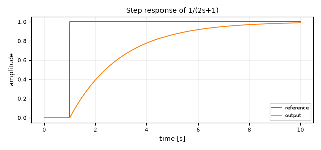
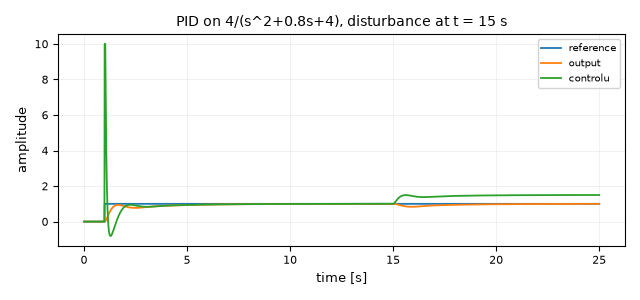
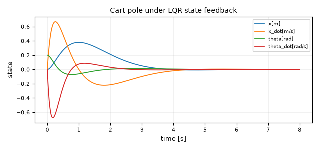
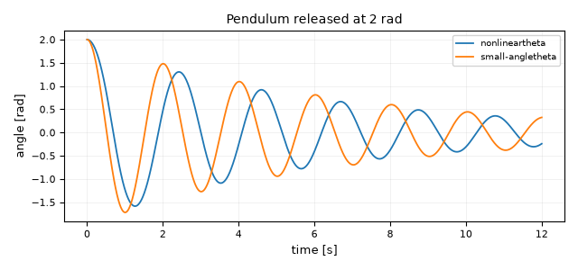
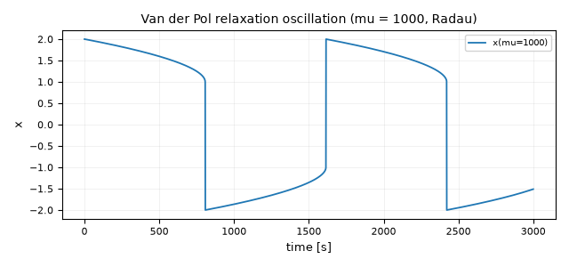
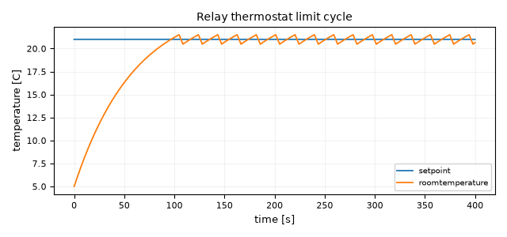
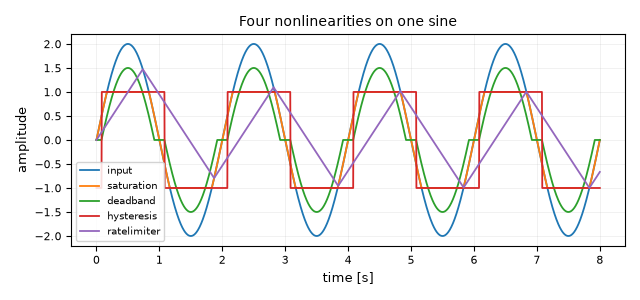
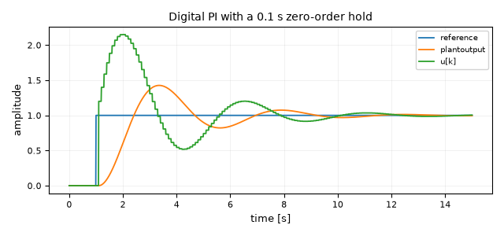
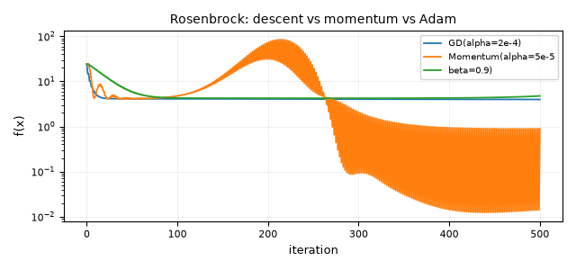

# Example gallery

Every diagram in `examples/` loads, runs headlessly and produces finite Scope
data — `tests/integration/test_example_gallery.py` runs all of them on every
push. Start at `first_order_step_response.diablos` and work down.

**In the app:** *File → Open*, pick a `.diablos` file, press `F5`.
Results appear in Scope / FieldScope windows.

**From a terminal**, without a display:

```bash
python diablos_modern.py run examples/pid_second_order.diablos -o out.csv
python diablos_modern.py export-python examples/pid_second_order.diablos -o model.py
```

> The headless `run` subcommand does not yet apply a diagram's saved
> `solver_method`, so `van_der_pol_stiff.diablos` runs under RK45 from the CLI
> (~80 s) instead of its saved Radau (~1 s). Open it in the GUI, or use
> `DSim.deserialize`, to get the stiff solver.

The `.diablos` format has no diagram-level description field, so the notes below
are the documentation for each file. Verification diagrams additionally carry a
`_verification_notes` JSON key with the analytical solution they are checked
against. This page mirrors `examples/README.md`; a test fails if either omits a
shipped diagram.

---

## Getting started

### `first_order_step_response.diablos`



Three blocks: a `Step` into `1/(2s+1)` into a two-input `Scope`. The smallest
complete diagram in the folder and the one to copy when starting from scratch —
it shows the wiring convention (reference tapped twice, once into the plant and
once into the scope) that every other control example reuses. Watch the output
reach 63 % of the reference one time constant (2 s) after the step at t = 1 s.
Try **Tools → Linearize** on it: the recovered transfer function should be the
one written on the block.

### `pi_loop_three_plants.diablos`

A PI controller `(2s+1)/s` closed around `1/(s+1)` and an integrator `1/s`. Its
value is what it exercises rather than what it teaches: the PI has a non-zero
feedthrough term (D = 2), so the compiled solver must schedule it with the
algebraic group rather than with the strictly-proper state blocks. If a change
to the execution ordering ever regresses, this is the diagram whose output goes
visibly sluggish. See "Compiled Solver Execution Order" in `CLAUDE.md`.

### `test_demux_logic.diablos`

A three-element `Constant` split by a `Demux` and recombined through an XOR
`LogicalOperator`. Small enough to read at a glance, and it is the fixture
behind `tests/regression/test_compiled_demux_logic.py`, so it doubles as the
worked example of vector routing.

---

## Control

### `pid_second_order.diablos`



A PID controller with output clamping (`u_min`/`u_max` = ±10) driving the
lightly damped plant `4/(s² + 0.8s + 4)`. The reference steps at t = 1 s and a
labelled load disturbance of −0.5 is injected at the plant input at t = 15 s.
Watch two things on the scope: the control signal sitting on its +10 limit
during the first transient (integrator windup is bounded, not eliminated), and
the integral action pulling the output back to the reference after the
disturbance. Good first target for **Tools → Parameter Sweep** over `Kp`.

### `c01_tank_feedback.diablos`

Proportional level control of a tank `1/(s + 0.2)` with a step reference of
8 units. The classic demonstration of proportional droop: the level settles
below the reference, and the gap shrinks as you raise `Kp` without ever closing.

### `c02_vehicle_single_agent.diablos`

First-order velocity dynamics `1/(s + 1)` followed by an `Integrator` to get
position. The building block every platoon and formation example in this folder
is assembled from.

### `c03_bode_frequency_response.diablos`

A sine of unit amplitude through `1/(s + 1)`, with input and output on one
scope. Read the gain and phase lag straight off the traces, then change `omega`
and confirm the −20 dB/decade roll-off by hand. **Tools → Bode** plots the same
information analytically.

### `c05_mass_spring_state_space.diablos`

A mass-spring-damper written as a `StateSpace` block with a 2×2 `C`, so position
and velocity come out as one vector and land on separate scope traces. The
starting point for anything that needs full state access.

### `c05_lqr_vs_open_loop.diablos`

The same oscillator twice: once with its own damping (`A[1][1] = −0.5`) and once
with the damping an LQR gain would produce (`−4`), both released from x = 2.
Two `StateSpace` blocks and no wiring between them — the cheapest possible
before/after comparison.

### `c06_lqr_state_feedback.diablos`

A double integrator stabilised by `u = −Kx`, with `K` in a `MatrixGain` and an
unconnected `LQR` marker block holding the `A`, `B`, `Q`, `R` that produced it.
Select the marker and run **Tools → LQR** to recompute the gain, then paste it
back into the `MatrixGain` and re-run.

### `c06_observer_estimation.diablos`

A second-order plant next to a Luenberger observer built from a second
`StateSpace` whose `B` carries both the input and the measurement injection.
The error scope is the one to watch: it starts at the initial-condition mismatch
and decays at the observer poles, not the plant poles.

### `inverted_pendulum_lqr.diablos`



Cart-pole linearised about the upright equilibrium (M = 1 kg, m = 0.1 kg,
l = 0.5 m), released 0.2 rad off vertical and caught by LQR state feedback. The
plant's `C` is the 4×4 identity, so a `Demux` fans the full state onto four
scope traces and a `MatrixGain` carrying `K` closes the loop. The story is in
the first two seconds: the controller drives the cart *under* the falling pole
(x goes positive before it comes back), which is exactly the non-minimum-phase
behaviour that makes the problem interesting. An unconnected `LQR` block records
the `Q = diag(5, 1, 20, 1)`, `R = 1` weights the gain came from — change them,
run **Tools → LQR**, and paste the new gain in.

### `pendulum_nonlinear_vs_linear.diablos`



A pendulum released at 2 rad (115°), integrated twice with `sin θ` in the loop
via a `MathFunction`, overlaid on the same scope with a `StateSpace` small-angle
model started from the same state. Both traces leave together and are visibly
out of phase within two swings: the nonlinear pendulum is slower, because its
period grows with amplitude. Drop the initial angle to 0.2 rad and the two
curves become indistinguishable — that is the small-angle approximation stated
as an experiment.

### `van_der_pol_stiff.diablos`



The Van der Pol oscillator at μ = 1000, built from two `Integrator`s, a
`MathFunction` square and a `Product`, saved with `solver_method = Radau`. A
relaxation oscillation: x sits on the cubic nullcline near ±2 for hundreds of
seconds, then flips in a fraction of a second. This is the diagram to open when
choosing a solver — Radau finishes in about a second, while RK45 grinds through
the same 3000 s horizon in over a minute and produces the same picture.

---

## Events and hybrid systems

### `relay_thermostat_events.diablos`



A `Hysteresis` relay (±0.5 °C band) heating a room modelled as `1/(60s + 1)`
above a 5 °C ambient, with a 21 °C setpoint. Bang-bang control with a genuine
limit cycle: the temperature saws between 20.5 °C and 21.5 °C forever, and the
switching instants are located by the compiled solver's zero-crossing detection
rather than being smeared across an integration step. Widen the band and the
cycle slows down; set `zero_crossing` to `off` in the simulation settings and
the corners of the sawtooth soften.

> Known issue: on the compiled path with zero-crossing enabled, the *relay's own
> scope trace* is recorded as a constant even though the loop is switching
> correctly (the temperature trace is right). See the strict `xfail` in
> `tests/integration/test_example_gallery.py`.

### `nonlinear_blocks.diablos`



One sine wave fanned into `Saturation`, `Deadband`, `Hysteresis` and
`RateLimiter`, with all five signals on one scope. The reference card for what
each nonlinearity does to a smooth input: clipping at ±1, a flat spot through
zero, a two-valued switch that depends on the direction of travel, and a slope
limit that turns the sine into a triangle.

---

## Discrete and multi-rate

### `discrete_pi_zoh.diablos`



A sampled-data loop: the continuous error passes through a `ZeroOrderHold` at
Ts = 0.1 s into a `DiscreteTranFn` PI controller `(1.2 − z⁻¹)/(1 − z⁻¹)`, which
drives the continuous plant `2/((s+1)(s+2))`. The command trace is a staircase
while the plant output is smooth — the visual definition of a sampled-data
system. Raise the sample time towards 0.5 s and watch the loop lose phase margin
and start ringing.

### `multirate_demo.diablos`

A 2 Hz sine sampled at 10 Hz by a `ZeroOrderHold`, then upsampled to 100 Hz by a
`RateTransition` in Linear mode, with a `FirstOrderHold` on a second scope for
comparison. Shows the three reconstruction behaviours side by side: staircase,
interpolating ramps and extrapolating sawtooth. See the
[Multi-Rate](Multi-Rate.md) page for the full treatment.

---

## Networks and multi-agent systems

### `c02_string_instability.diablos`

Three identical vehicles in a string, each following the one ahead through
`(0.9s + 0.2)/(s³ + s² + 0.9s + 0.2)`. The leader's step is amplified as it
propagates: vehicle 3 overshoots more than vehicle 1. That growth along the
string is string instability, and it is why constant-headway spacing policies
exist.

### `c08_consensus_ring.diablos`

Four agents on a ring, written as a single `StateSpace` whose `A` is the
negative graph Laplacian. All four states converge to the average of their
initial conditions — the canonical consensus result, in one block.

### `c08_consensus_topology.diablos`

The same experiment on a path graph and on a complete graph, side by side from
identical initial conditions. The complete graph settles several times faster:
the convergence rate is the second-smallest Laplacian eigenvalue, and you can
see the ratio directly in the two scopes.

### `c09_formacion_distancia.diablos`

Two agents in the plane running a distance-based formation law, with the
position error driven through `MatrixGain` and `SgProd` blocks and the squared
inter-agent distance on its own scope converging to the desired 4. Includes an
`AgentScope` that animates the agents in the plane rather than against time.

### `c11_opinion_dynamics.diablos`

Six people on a social graph running the same Laplacian flow as the consensus
examples, started from spread-out opinions. Watch the sub-communities agree with
each other before the whole network does.

### `c12_sis_epidemics.diablos`

Networked SIS epidemics: an `Integrator` holding six infection probabilities, a
`MatrixGain` carrying the adjacency matrix, and a `Function` block evaluating
`0.5·(Ax)ᵢ·(1 − xᵢ) − xᵢ`. One node starts at 30 % infected; the endemic
equilibrium the whole network settles to depends on the ratio of infection to
recovery rate.

### `c12x_kuramoto_sync.diablos`

Six Kuramoto oscillators with heterogeneous natural frequencies and coupling
strength 3.0, written as a single `Function` block over the phase vector. The
phases fan out, then lock into a common drift. Lower the coupling in the
expression and synchronisation is lost.

### `c13_distributed_subgradient.diablos`

Six agents minimising the sum of their local costs by combining a consensus term
with a pull towards their own target, again folded into one `StateSpace`. The
estimates converge to the average of the local targets rather than to any single
agent's optimum.

---

## Optimization

The first four diagrams here drive **Tools → Run Optimization**, which searches
over the `Parameter` blocks to minimise the `CostFunction` block. Open one, run
the optimizer, and the tuned values are written back into the `Parameter`
blocks.

### `optimization_basic_demo.diablos`

One tunable gain. A `Parameter` block feeds an `SgProd` acting as the
controller, and an ISE `CostFunction` measures tracking error on
`1/(s² + 2s + 1)`. The simplest possible optimization setup, and the wiring
pattern the others extend: parameters are ordinary signals, and the `Optimizer`
block is an unconnected marker.

### `optimization_pid_tuning_demo.diablos`

Three tunable parameters (`Kp`, `Ki`, `Kd`) multiplying the proportional,
integral and derivative branches of a hand-built PID, minimising ITAE on
`1/(s² + 1.5s + 1)` with Nelder-Mead. ITAE weights late error more heavily than
early error, so the tuned response settles rather than merely rising fast.

### `optimization_constrained_demo.diablos`

The same loop under a `Constraint` block: peak output ≤ 1.15. With the shipped
gains the plant overshoots to about 1.45, so the constraint scope starts at a
non-zero violation — that is the point. SLSQP is required here; the
unconstrained methods ignore `Constraint` blocks.

### `optimization_data_fit_demo.diablos`

A gain and a first-order lag producing the reference response that
`optimization_sample_data.csv` was generated from. Point a `DataFit` block at
that CSV and add `Parameter` blocks for the gain and the time constant to turn
it into a model-calibration exercise.

### Optimization primitives

These build optimizers out of ordinary blocks in a feedback loop, one iteration
per time step (`sim_dt = 1.0`), so the "time" axis on their scopes is an
iteration counter.

### `gradient_descent_simple.diablos`

The minimal loop: a `StateVariable` holding x, an `ObjectiveFunction` for
`x₁² + x₂²`, a `NumericalGradient` built from two `VectorPerturb` evaluations,
and a `VectorGain` of −0.2 closing the loop. Read this one before the others.

### `gradient_descent_demo.diablos`

The same descent at α = 0.1 with a `ResidualNorm` on the gradient, so you can
watch `‖∇f‖` decay geometrically alongside the cost.

### `gradient_descent_verification.diablos`

Runs the numerical descent against the closed form `x(k) = (1 − 2α)ᵏ x₀`
computed in parallel from a `Ramp` and a `MathFunction`, and displays the
absolute difference. It should stay below 1e-10 for the whole run.

### `momentum_demo.diablos`

Momentum (α = 1e-4, β = 0.9) on the Rosenbrock function from the classic start
x₀ = [−1.2, 1]. The cost spikes as the iterate is flung across the valley, then
descends — velocity is what lets it make progress along the valley floor at all,
and also what makes it overshoot.

### `adam_demo.diablos`

Adam on the same Rosenbrock function from [−2, 2]. Per-coordinate step sizes
cope with the enormously different curvatures along and across the valley
without any hand-tuning of α.

### `newton_method_demo.diablos`

A `RootFinder` block solving `x₁² + x₂ − 1 = 0`, `x₁ + x₂² − 1 = 0` from
[0.5, 0.5], with both residuals and `‖F(x)‖` on scopes. Convergence is
quadratic — the residual norm falls off the bottom of the plot in a handful of
iterations.

### `newton_method_verification.diablos`

The same system from [0.8, 0.2], measured against the exact root [1, 0]. Both
`‖x − x*‖` and `‖F(x)‖` should reach 1e-10 or below.

### `linear_system_demo.diablos`

`LinearSystemSolver` solving `Ax = b` for A = [[2, 1], [1, 3]], b = [5, 7], with
the answer and the recomputed `Ax` shown on `Display` blocks. Note that this
diagram has no `Scope` at all — the result is a number, not a trajectory.

### `linear_system_verification.diablos`

The same solve, with `‖x − x*‖` against the exact [1.6, 1.8] and the residual
`‖Ax − b‖` on `Display` blocks. Both should read below 1e-14.

### `learning_rate_comparison.diablos`

Four independent gradient-descent loops on `f(x) = x²` at α = 0.1, 0.4, 0.6 and
1.2, sharing one scope. The four regimes of `|1 − 2α|`: slow, near-optimal,
oscillating and divergent. The α = 1.2 trace is *supposed* to run away — it is
the lesson, not a bug.

### `optimizer_comparison.diablos`



Gradient descent, momentum and Adam on Rosenbrock from x₀ = [−1.2, 1] with the
step sizes each needs to stay stable (2e-4, 5e-5 and 5e-3). Momentum reaches the
lowest cost; plain descent is monotone but slow. The honest takeaway is that
each method needs its own learning rate — the same α makes two of the three
diverge.

### `convergence_rates.diablos`

Gradient descent against Newton's method on the root of `4x³`, with a
`log₁₀|x|` scope. Linear convergence is a straight line on that scope; quadratic
convergence falls off a cliff.

---

## Partial differential equations

PDE blocks discretise space with the method of lines and hand the resulting ODE
system to the same solver everything else uses. `FieldProbe` extracts a scalar
for a `Scope`; `FieldScope` shows the whole field over time as a heatmap.

### Demonstrations

### `heat_equation_demo.diablos`

`∂T/∂t = α∇²T` on a rod with N = 20 nodes, held at 100 °C on the left and 0 °C
on the right from a uniform 20 °C start. Two `FieldProbe`s at x = 0.25 and
x = 0.5 track the interior temperatures towards the steady linear gradient
(75 °C and 50 °C), and the `FieldScope` shows the heat front sweeping right.

### `wave_equation_demo.diablos`

A vibrating string released from a sinusoidal displacement with fixed ends. The
`FieldScope` shows a standing wave; the probes show simple harmonic motion at
the fundamental.

### `advection_equation_demo.diablos`

A Gaussian pulse transported at constant velocity past three probes. Watch the
pulse broaden as it travels — that spreading is numerical diffusion from the
first-order upwind scheme, not physics. Raise `N` and it shrinks.

### `diffusion_reaction_demo.diablos`

`∂c/∂t = D∇²c − kc`: diffusion and first-order decay together, sampled at three
positions. The profile spreads and sinks at the same time.

### `heat_equation_2d_demo.diablos`

The 2D heat equation on a 25×25 plate, hot on the left edge, insulated top and
bottom. `FieldScope2D` renders the plate with a time slider; `FieldProbe2D`
blocks pull out the centre and off-centre temperatures.

### `pde_comparison_demo.diablos`

Heat, wave and advection equations from the same sinusoidal initial condition,
each with its own `FieldScope`, plus one shared scope comparing the value at
x = 0.5. Diffusion decays, the wave oscillates, the pulse translates — three
behaviours from three one-line PDEs.

### `pde_neumann_bc_demo.diablos`

An insulated rod (zero-flux Neumann boundaries) with a Gaussian hot spot. The
`FieldIntegral` scope is the one to watch: total heat stays constant while the
profile flattens, which is the numerical statement that no energy leaves through
the ends.

### Verification diagrams

Each of these runs the numerical solution alongside its analytical counterpart
and plots the difference. They carry the problem statement and the closed-form
solution in a `_verification_notes` key inside the file.

### `heat_equation_1d_verification.diablos`

`T(x, 0) = sin(πx/L)` decays as `exp(−απ²t/L²)` with the shape preserved; the
error scope should stay near zero.

### `wave_equation_1d_verification.diablos`

`u(x, t) = sin(πx/L)·cos(πct/L)`: a standing wave of period 2L/c = 2 s.

### `advection_equation_1d_verification.diablos`

A Gaussian translated at velocity v. The error here is dominated by the upwind
scheme's numerical diffusion, so it is larger than in the other three — this
diagram is where you see the cost of a first-order scheme.

### `diffusion_reaction_1d_verification.diablos`

`c(x, t) = sin(πx/L)·exp(−(Dπ²/L² + k)t)`: diffusion and reaction contribute
additively to the decay rate.

### `heat_equation_2d_verification.diablos`

`T = sin(πx)·sin(πy)·exp(−2απ²t)` on the unit square — the 2D separable mode,
with a time slider on the field view.

---

## Experiments

### `monte_carlo_robustness.diablos`

A PI loop whose measurement path passes through a `Noise` block (σ = 0.02) and a
`PacketLoss` block (20 % Bernoulli loss, sampled at 20 Hz, hold-last-value on
drop). Both expose a `seed`, which is what makes this diagram an *experiment*
rather than a single run: **Tools → Monte Carlo** derives a per-block sub-seed
from one master seed for each replicate, so the whole ensemble is reproducible
from a single number. Run 50 replicates and read the spread of overshoot and
settling time off the ensemble window. `parameter_sweep` works the same way for
deterministic sweeps — try it on `pid_second_order.diablos` over `Kp`.

---

## Library blocks and masks

### `library_block_demo.diablos`

A masked **Vehicle** subsystem — `v(s)/F(s) = 1/(ms + b)` — inside a
proportional speed loop tracking 20 m/s. The mask exposes the mass `m` and
damping `b` as ordinary parameters; the inner `TranFn` stores
`denominator = "[m, b]"` and the mask resolves those names before flattening, so
the symbolic expression survives every save and re-run. Select the Vehicle block
and edit `m` in the property panel to see the response change; the steady state
is `20·K/(K + b)`.

The same block is published as a library block in `examples/library/`:

```bash
DIABLOS_LIBRARY_PATH=examples/library python diablos_modern.py
```

"Vehicle" then appears in the palette under **User Library**, ready to drop into
any diagram. See *Library blocks and masks* in
[USER_MANUAL.md](../USER_MANUAL.md).

---

## Other files in this folder

| File | What it is |
|------|------------|
| `library/vehicle.diablos` | The published form of the Vehicle library block above. |
| `optimization_sample_data.csv` | Sample measurements for a `DataFit` block. |
| `example_usage.py` | A script, not a diagram: shows driving `DSim` and `lib.improvements` from Python. |

## Adding your own

1. Build the diagram, set *sim_time* / *sim_dt* (and the solver, if it is stiff)
   in the simulation settings, and add a `Scope`.
2. Save it in `examples/` as `<topic>_<what_it_shows>.diablos`.
3. Add a paragraph to `examples/README.md` **and** to this page — a test fails if either
   omits a shipped diagram.
4. Optionally add a `_verification_notes` key with the analytical solution:

```json
{
    "sim_data": { "sim_time": 10.0, "sim_dt": 0.01 },
    "blocks_data": [ ],
    "lines_data": [ ],
    "_verification_notes": {
        "problem": "What is being solved",
        "analytical_solution": "The closed form",
        "parameters": { "alpha": 0.1 }
    }
}
```
