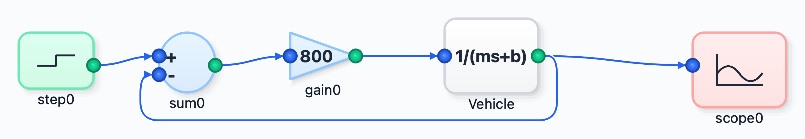
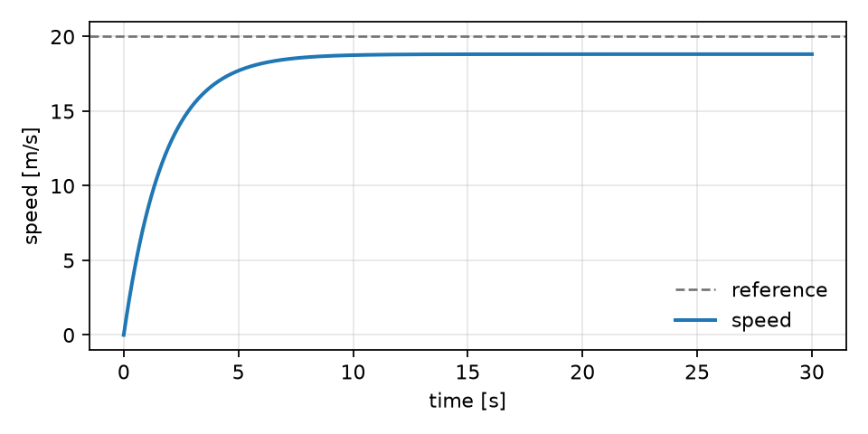

# Summary

DiaBloS Modern is a desktop application for building, simulating and analysing
dynamical systems drawn as block diagrams. A user drags blocks onto a canvas,
wires them together, presses run, and reads the result on a scope, in the way
that Simulink [@mathworks2025simulink] and Xcos [@campbell2010scilab] have
taught two generations of engineers to work. Everything underneath is Python:
diagrams are JSON, blocks are small classes, and simulation runs on NumPy
[@harris2020numpy] and SciPy [@virtanen2020scipy]. The same diagram can be
linearised into a state-space model and inspected with Bode, Nyquist,
root-locus and LQR views, swept over parameter grids, run as a seeded Monte
Carlo ensemble, exported as TikZ for a paper or as a standalone script, or
simulated headlessly from the command line. It grew out of DiaBloS
[@torrestorriti2025diablos], and keeps that project's goal of an open,
readable block-diagram tool for the Python ecosystem.

# Statement of need

Teaching and researching feedback control means moving constantly between a
picture and a computation. The picture is the block diagram: a plant, a
controller, a summing junction, a loop closed by an arrow. The computation is
an integration, a Bode plot, a pole placement, a robustness study. Commercial
tools join the two, but they are proprietary, expensive outside a campus
licence, and closed at exactly the point where a student would learn the most,
namely how a diagram becomes an ordinary differential equation.

The open Python ecosystem covers each half well and the join less well.
python-control [@fuller2021pythoncontrol] gives excellent analysis but no
diagram. PathSim [@rother2025pathsim] and bdsim [@corke2024bdsim] both simulate
block diagrams and both ship a graphical editor, PathView and bdedit
respectively, but the Python API is the primary interface in each and the
editor is a companion to it; neither documents classical control analysis
against the assembled model. pysimCoder [@lenc2023pysimcoder] is editor-first,
but its centre of gravity is real-time code generation for embedded targets.
Outside Python, Xcos [@campbell2010scilab] and OpenModelica
[@fritzson2020openmodelica] are mature and graphical, but they place the user
in a different language and toolchain from the NumPy/SciPy stack that the rest
of a modern course or lab already runs on.

DiaBloS Modern aims at the gap: a Python-native visual laboratory for dynamics
and control. The canvas is the primary interface, not a front end to a script,
and the application is distributed as prebuilt macOS and Windows binaries as
well as source, so a class can start without first standing up a Python
environment. Classical control analysis is attached to the diagram rather than
to a separate script, so linearisation, frequency response and pole placement
are one menu away from the loop being studied. Computational experiments,
ensembles and sweeps, are first-class rather than something a user must script
by hand. The same engine runs headlessly for scripting, batch work and
continuous integration. The interface is localisable and ships English and
Spanish catalogues, which matters for the Spanish-speaking engineering
classrooms the project serves.

# Functionality

**Block library.** The palette holds 96 blocks in 12 categories.[^counts]
Sources (11) cover steps, ramps, chirps, PRBS, noise and file input; Math (12)
and Logic (3) cover arithmetic, lookup tables and comparisons; Control (17)
covers integrators, transfer functions, state space, PID, delays, saturation,
hysteresis and discrete-time equivalents; Routing (8) covers mux/demux,
selectors, switches and tag-based Goto/From links, plus lossy network channels;
Sinks (8) cover scopes, displays, FFT and CSV export; PDE (16) covers 1D and 2D
heat, wave, advection and diffusion-reaction blocks with field probes and
field scopes; Optimization (5) and Optimization Primitives (11) cover
gradient-descent, momentum, Adam, root finding and least-squares fitting;
Analysis (4) supplies Bode, Nyquist and root-locus sinks.

**Two execution paths.** The interpreter walks the diagram block by block at a
fixed step and runs anything, including user Python blocks. The compiled path
flattens the diagram, maps every state-carrying block into one global state
vector, assembles a single right-hand side and hands it to
`scipy.integrate.solve_ivp` with a choice of eight methods (RK45, RK23, DOP853,
Radau, BDF, LSODA, and fixed-step RK4 and Euler). Compiled results are treated
as the reference and are checked against closed-form solutions in the
regression suite. A diagram containing a block with no compiled kernel, or one
gated to a discrete sample time, falls back to the interpreter automatically.

**Zero-crossing events.** Discontinuous blocks make the assembled right-hand
side piecewise, which an adaptive Runge-Kutta step cannot represent. Saturation,
deadband, switch, hysteresis, absolute value, the step and ramp edges, square
and sawtooth waves and PRBS therefore hand the solver scalar event functions.
Integration stops at each located root, applies any discrete update such as a
relay latch, and restarts, so switching instants land on their true time
instead of being smeared across whichever step straddled them. A chattering
guard bounds the work: a relay in sliding mode falls back to a fixed step with
a warning rather than hanging.

**Composition.** Subsystems nest, masks give a subsystem its own small
parameter surface, and a masked subsystem saved to its own file becomes a
reusable library block on the palette. Mask parameters resolve before
flattening, so every consumer, both engines, the code generator and the
headless runners, sees resolved values.

**Analysis and experiments.** Linearisation takes a numeric Jacobian of the
compiled right-hand side by finite differences, yielding A, B, C and D, and
from there pole-zero maps, step and impulse responses, Bode plots with gain and
phase margins, Nyquist plots, root loci and LQR design. Trim solves for an
operating point on the same right-hand side. Monte Carlo ensembles re-run a
diagram with per-block sub-seeds derived from one master seed, so a whole
experiment is reproducible from a single number, and 1D and 2D parameter sweeps
produce response families and outcome heatmaps. Both runners snapshot and
restore block parameters, so an experiment never mutates the user's diagram.

**Export.** Diagrams export to TikZ and to the LaTeX `blox` macros for papers
and slides, to SVG and PNG, and to a standalone NumPy/SciPy script that
reproduces the compiled solver outside DiaBloS. Field scopes export animations
as GIF or MP4. Plots use Matplotlib [@hunter2007matplotlib] and PyQtGraph
[@campagnola2025pyqtgraph]; the interface is built on PyQt5 [@riverbank2025pyqt].

[^counts]: Block and category counts were obtained by instantiating every class
returned by `lib.block_loader.load_blocks()` and grouping by its `category`
property. The repository ships 46 example diagrams and a test suite of 3512
tests (`pytest --collect-only`).

# Example

\autoref{fig:diagram} shows `examples/library_block_demo.diablos`, a cruise
control loop. `Vehicle` is a user library block: a masked subsystem exposing
mass `m` and drag `b`, whose inner transfer function is written as `1/(ms+b)`
and resolved from the mask scope at run time. A step commands 20 m/s, the
summing junction forms the speed error, and a gain of 800 drives the vehicle.

\autoref{fig:response} is the resulting speed, from a headless compiled run
over 30 s. The loop settles at 18.8 m/s rather than 20, the steady-state offset
$Kr/(K+b)$ that proportional-only control leaves behind. Both figures are
produced by `paper/make_figures.py`: the diagram through the application's own
image exporter, the trace by simulating the same file through the headless CLI
path and plotting the scope buffer.

{ width=85% }

# Comparison with related tools

The table below compares only what each project's own documentation states; a
blank is an absence of documentation, not a claim that a feature is missing.

| Tool | Primary interface | Runtime | Control analysis on the model |
| --- | --- | --- | --- |
| DiaBloS Modern | Desktop editor | Python | Linearisation, Bode, Nyquist, root locus, LQR, trim |
| DiaBloS | Desktop editor | Python | Not documented |
| PathSim | Python API, with a web editor | Python | Not documented |
| bdsim | Python API, with a desktop editor | Python | Not documented |
| pysimCoder | Desktop editor | Python and generated C | Via python-control |
| Xcos | Desktop editor | Scilab | Yes |
| OpenModelica | Desktop editor | Modelica | Partial |
| Simulink | Desktop editor | MATLAB | Yes, proprietary |

DiaBloS Modern is not a competitor to Modelica's acausal modelling or to
Simulink's breadth of toolboxes, and PathSim's own solver suite covers stiff
and hybrid problems that DiaBloS delegates to SciPy. Its niche is narrower and,
we think, underserved: an open, readable, graphical desktop tool that keeps the
whole loop, model, simulation, analysis and experiment, inside Python.

# Acknowledgements

DiaBloS Modern is a fork and modernisation of DiaBloS by Matías Rojas-Sepúlveda
and Miguel Torres-Torriti [@torrestorriti2025diablos; @rojas2024thesis], whose
block-diagram processing algorithm and original PyGame implementation are the
foundation this work builds on. We thank the maintainers of NumPy, SciPy,
Matplotlib, PyQt and PyQtGraph.

# References
